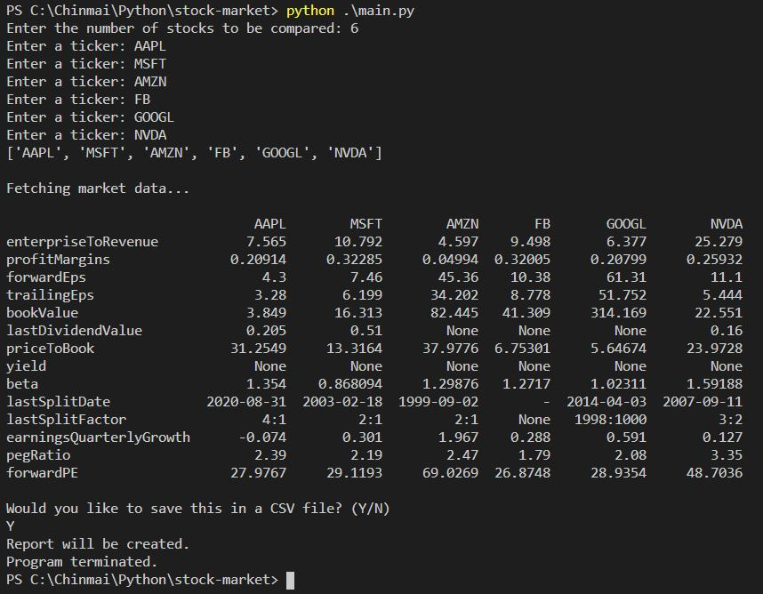
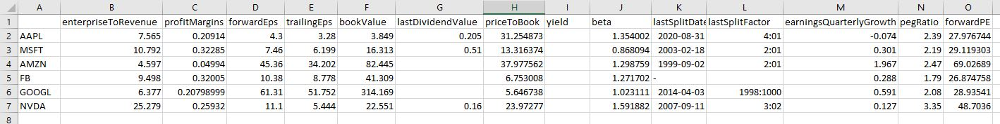

# stock-market-analysis-tool

This is a simple tool that can be used to compare and analyze key statistics of various stocks listed on major exchanges.  
  
## How it works

When the program is run, it first queries how many stocks are going to be compared.  
The program then asks for the stock tickers.  
For US stocks, use the NYSE ticker.  
For foreign stocks, use the respective stock exchange's ticker followed by the stock exchange code.  
For example, Toronto Stock Exchange's Canadian National Railway stock would be "CNR.TO".  
Bombay Stock Exchange's, HDFC Bank would be "HDFCBANK.BO", and so on.  

Once the data is displayed in the terminal, the program will give you the option of saving the
data in a CSV file for further analysis. A sample of what the saved CSV file would look like is shown below:

